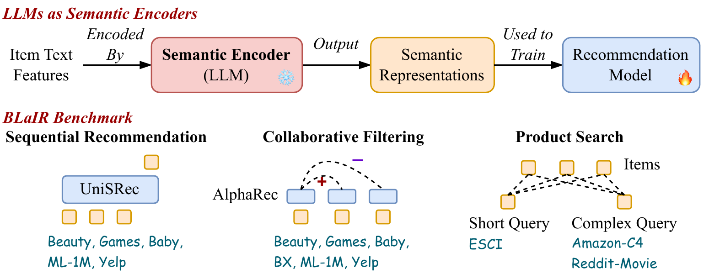
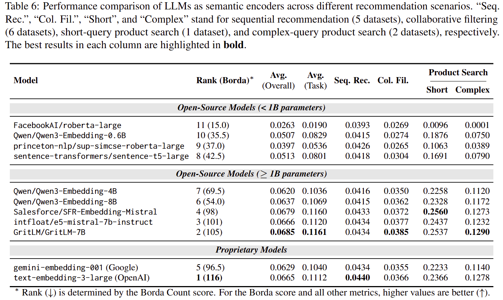

# BLaIR-Bench

**B**ridging **La**nguage and **I**tems for **R**etrieval and **R**ecommendation: Benchmarking LLMs as Semantic Encoders

BLaIR-Bench is a toolkit for evaluating how well language models encode item text features for recommendation and retrieval tasks, including collaborative filtering, sequential recommendation, and product search. It measures the quality of semantic representations produced by LLMs when used as frozen encoders to train downstream recommendation models.

<p align="center">
  
</p>

## Supported Tasks and Datasets

| Task | Model | Dataset(s) | Metric |
|---|---|---|---|
| Sequential Recommendation | UniSRec (inductive) | All_Beauty, Video_Games, Baby_Products, ML-1M, Yelp | NDCG@10 |
| Collaborative Filtering | AlphaRec (linear mapping) | All_Beauty, Video_Games, Baby_Products, Book-Crossing, ML-1M, Yelp | NDCG@10 |
| Product Search (short query) | Embedding similarity | ESCI | NDCG@100 |
| Product Search (complex query) | Embedding similarity | Amazon-C4, Reddit-Movie | NDCG@100 |

A large portion of these datasets comes from our newly collected Amazon Reviews 2023 dataset. See [amazon-reviews-2023.github.io](http://amazon-reviews-2023.github.io/) for details.

## Supported Encoders

| Category | Models | Type |
|---|---|---|
| Sentence Transformers | `sentence-transformers/all-MiniLM-L6-v2`, etc. | Local |
| SimCSE | `princeton-nlp/sup-simcse-bert-base-uncased`, etc. | Local |
| BERT-like | `bert-base-uncased`, `roberta-large`, etc. | Local |
| GTE | `Alibaba-NLP/gte-Qwen2-7B-instruct`, etc. | Local |
| GritLM | `GritLM/GritLM-7B`, etc. | Local |
| E5 | `intfloat/e5-mistral-7b-instruct`, `Salesforce/SFR-Embedding-Mistral`, etc. | Local |
| Qwen3 Embedding | `Qwen/Qwen3-Embedding-0.6B`, `Qwen/Qwen3-Embedding-8B`, etc. | Local |
| OpenAI | `text-embedding-3-large`, etc. | API |
| Google Gemini | `gemini-embedding-001` | API |

See [docs/add_new_encoder.md](docs/add_new_encoder.md) for instructions on adding new encoders.

## Results

<p align="center">
  
</p>

## Installation

> [!CAUTION]
> The GPU installation requires CUDA 12.4. If you encounter segmentation faults, verify your CUDA version with `nvcc --version`.

### GPU (recommended)

```bash
conda create -n blair python=3.11
conda activate blair
pip install vllm==0.8.5.post1
pip install flash-attn --no-build-isolation
pip install -r requirements.txt
# You may see a version conflict for ray, which is expected
pip install ray==2.49.2
```

### CPU only

```bash
conda create -n blair python=3.11
conda activate blair
pip install -r requirements.cpu.txt
```

### API-based encoders

To use OpenAI or Gemini embedding models, set your API key as an environment variable:

```bash
export OPENAI_API_KEY="YOUR KEY"       # for text-embedding-3-large
export GEMINI_API_KEY="YOUR KEY"       # for gemini-embedding-001
```

## Quick Start

### Using `pipeline.py` (recommended)

```bash
# Sequential recommendation
python pipeline.py --model bert-base-uncased --task seq_rec --datasets ML-1M Yelp --gpu_id 0

# Collaborative filtering (omit --datasets to run all)
python pipeline.py --model bert-base-uncased --task cf --gpu_id 0

# Product search
python pipeline.py --model bert-base-uncased --task prod_search --datasets esci --gpu_id 0

# With PCA dimensionality reduction
python pipeline.py --model bert-base-uncased --task seq_rec --datasets ML-1M --gpu_id 0 --pca --whiten --n_comps 128
```

Run `python pipeline.py --help` for all available options.

### Using the Python API

```python
from blair.blair import BLaIRBenchmark
from blair.utils import init_semantic_encoder

semantic_encoder = init_semantic_encoder(
    model='roberta-base',
    gpu_id=0,
    batch_size=32,
    emb_type='CLS',
    pca=False,
    n_comps=0,
)

benchmark = BLaIRBenchmark(
    task="cf",
    datasets=["All_Beauty", "Baby_Products"],
    gpu_id=0,
    cache_path="cache",
    eval_batch_size=64,
    features_needed=['title'],
)

results = benchmark.run(
    semantic_encoder,
    output_folder="results",
    gpu_id=0,
    hyperdict={"learning_rate": [3e-3, 1e-3, 3e-4]},
)

print("Test results:", results)
```

See [examples/example.py](examples/example.py) for a complete runnable example.

## Project Structure

```
BLaIR-Bench/
├── blair/                    # Core library
│   ├── blair.py              # BLaIRBenchmark orchestrator
│   ├── utils.py              # Encoder factory & PCA utilities
│   ├── encoders/             # Semantic encoder implementations
│   ├── seq_rec/              # Sequential recommendation (UniSRec)
│   ├── cf/                   # Collaborative filtering (AlphaRec)
│   └── prod_search/          # Product search evaluation
├── pipeline.py               # CLI entry point
├── examples/                 # Example scripts
├── tests/                    # Test suite
├── assets/                   # Images for README
├── docs/                     # Documentation
├── requirements.txt          # GPU dependencies
└── requirements.cpu.txt      # CPU-only dependencies (for CI)
```

## Datasets

All datasets are downloaded automatically at runtime:
- **Amazon 2023** (All_Beauty, Video_Games, Baby_Products) — from [HuggingFace](https://huggingface.co/datasets/McAuley-Lab/Amazon-Reviews-2023)
- **ML-1M** — from [Kaggle](https://www.kaggle.com/datasets/odedgolden/movielens-1m-dataset)
- **Book-Crossing** — from [Kaggle](https://www.kaggle.com/datasets/ruchi798/bookcrossing-dataset)
- **Yelp** — from [Kaggle](https://www.kaggle.com/datasets/yelp-dataset/yelp-dataset)
- **ESCI, Amazon-C4, Reddit-Movie** — from [HuggingFace](https://huggingface.co/datasets/McAuley-Lab/BLaIR-Bench-API)

Pre-computed embeddings for API-based and large encoders are available on the [BLaIR-Bench-API HuggingFace repository](https://huggingface.co/datasets/McAuley-Lab/BLaIR-Bench-API). 

> [!NOTE]
> These cached embeddings are only precomputed for recommendation tasks (sequential recommendation and collaborative filtering), not for product search tasks.

## Acknowledgements

The recommendation experiments in BLaIR-Bench are implemented using the open-source recommendation library [RecBole](https://github.com/RUCAIBox/RecBole). We also build on [UniSRec](https://github.com/RUCAIBox/UniSRec) and [AlphaRec](https://github.com/LehengTHU/AlphaRec).

## Citation

If you find BLaIR-Bench or our scripts/code helpful, please cite the following paper:

```bibtex
@article{hou2026bridging,
  title={Bridging Language and Items for Retrieval and Recommendation: Benchmarking LLMs as Semantic Encoders},
  author={Yupeng Hou and Jiacheng Li and Xiangjun Fu and Zhankui He and An Yan and Xiusi Chen and Julian McAuley},
  conference={ACL},
  year={2026}
}
```

## License

This project is licensed under the MIT License. See [LICENSE](LICENSE) for details.
